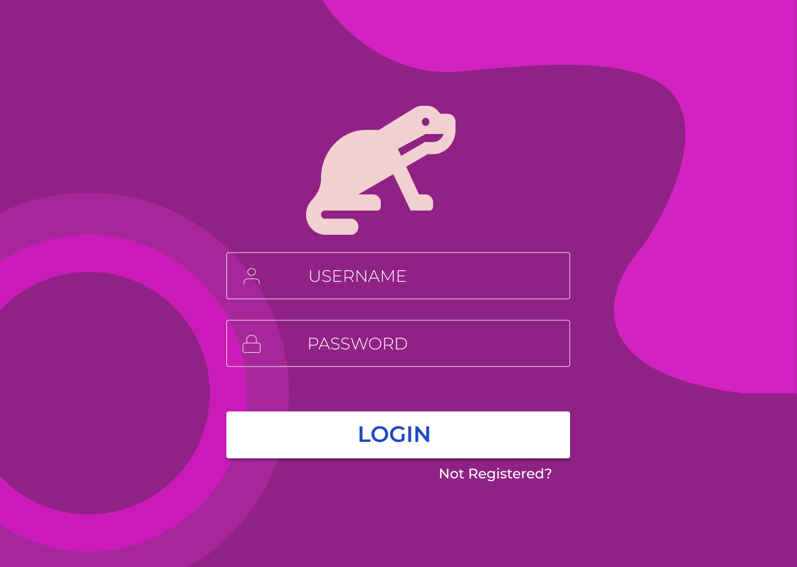
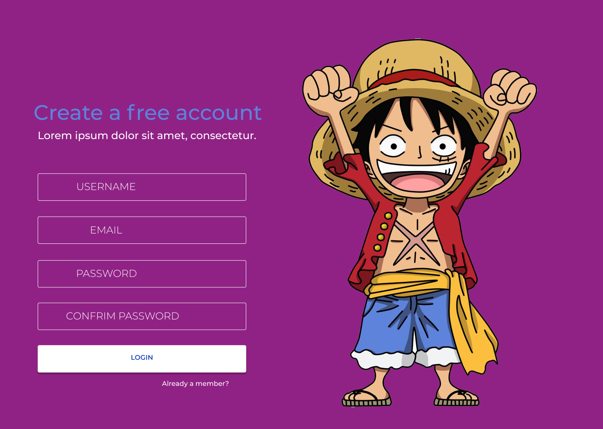
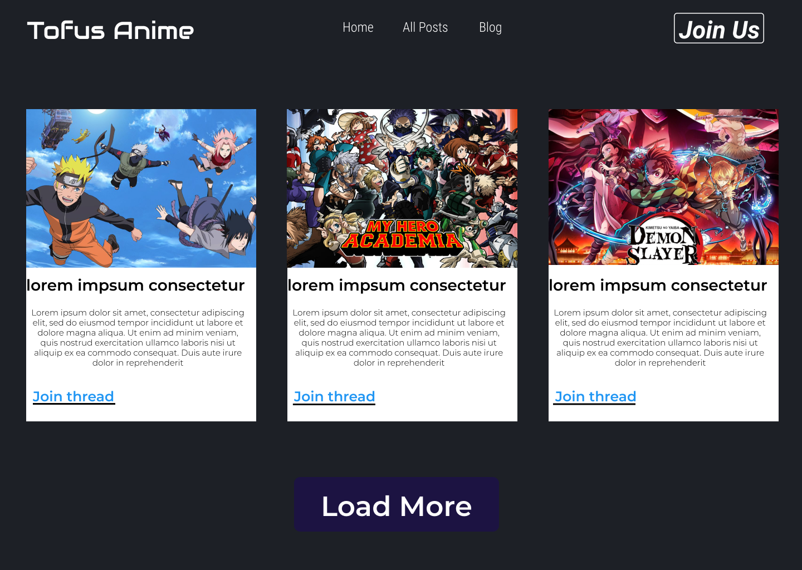
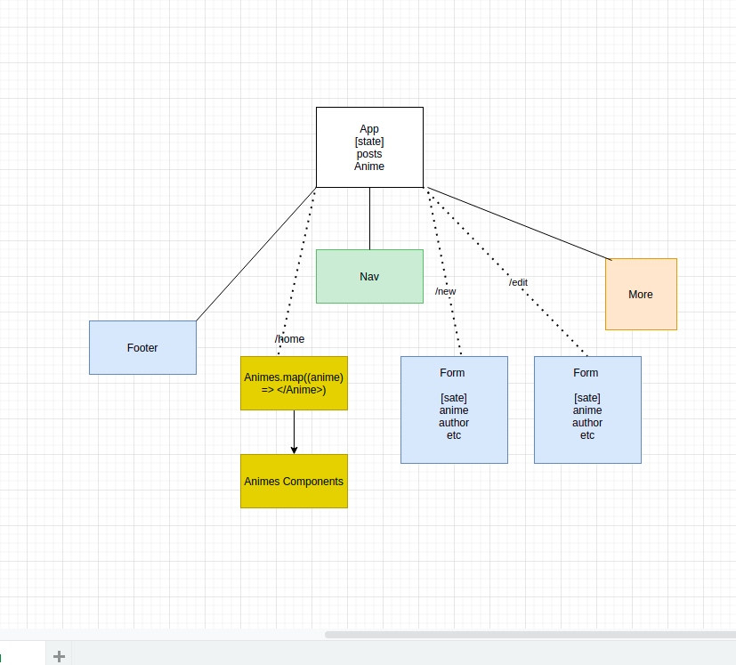

<h1 align="center">Welcome to Tofu's Anime👋</h1>
<p>
  
  <a href="https://github.com/git/git-scm.com/blob/main/MIT-LICENSE.txt" target="_blank">
    
  </a>
  <a href="https://twitter.com/Abdifatah Osman" target="_blank">
    
  </a>
</p>

> A social anime app to share hot takes on your favorite anime
## Wireframes

### Desktop





## Install

```sh
npm install 
```

## Component Hierarchy



## API and Data Sample
```
{
    "records": [
        {
            "id": "recCOmOPqDMN4SZnu",
            "fields": {
                "Name": "One Piece",
                "Creator": "Eiichiro Oda"
            },
            "createdTime": "2021-09-19T01:37:04.000Z"
        },
        {
            "id": "recASzRcYN16QN6N9",
            "fields": {
                "Name": "One Punch Man",
                "Creator": "ONE"
            },
            "createdTime": "2021-09-19T01:37:04.000Z"
        },
        {
            "id": "recx6BZAavxCWY5Ds",
            "fields": {},
            "createdTime": "2021-09-19T01:37:04.000Z"
        }
    ],
    "offset": "recx6BZAavxCWY5Ds"
}
```

## Author

👤 **Abdifatah Osman**

* Website: (https://abdifatahosman.com)
* Twitter: [@Abdifatah Osman](https://twitter.com/omarosman258)
* Github: [@AbdifatahOsman2](https://github.com/AbdifatahOsman2)
* LinkedIn: [@Abdifatah Osman](https://linkedin.com/in/abdifatahothman)

## Show your support

Give a ⭐️ if this project helped you!

## 📝 License

Copyright © 2022 [Abdifatah Osman](https://github.com/AbdifatahOsman2).<br />
This project is [MIT](https://github.com/git/git-scm.com/blob/main/MIT-LICENSE.txt) licensed.

***
_This README was generated with ❤️ by [readme-md-generator](https://github.com/kefranabg/readme-md-generator)_# Anime App
# Tofu-Animev2
